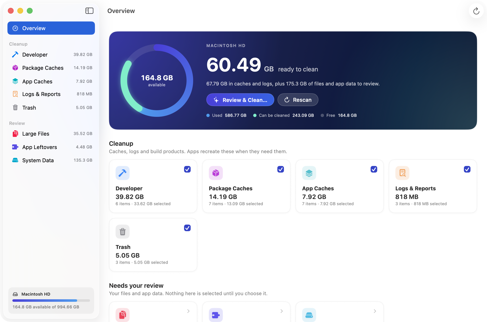
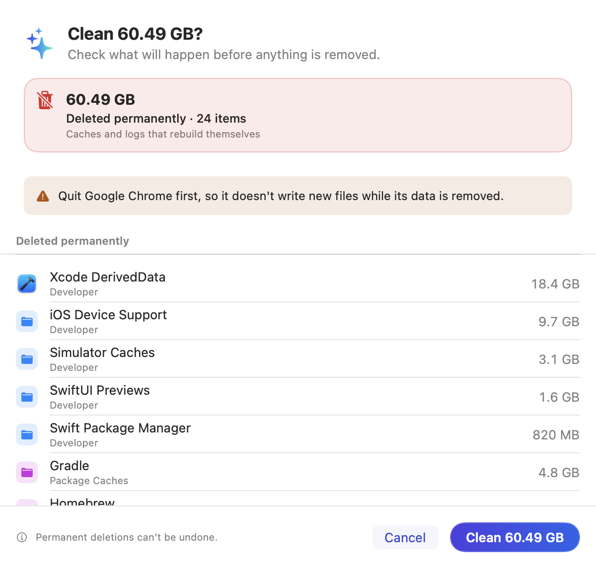
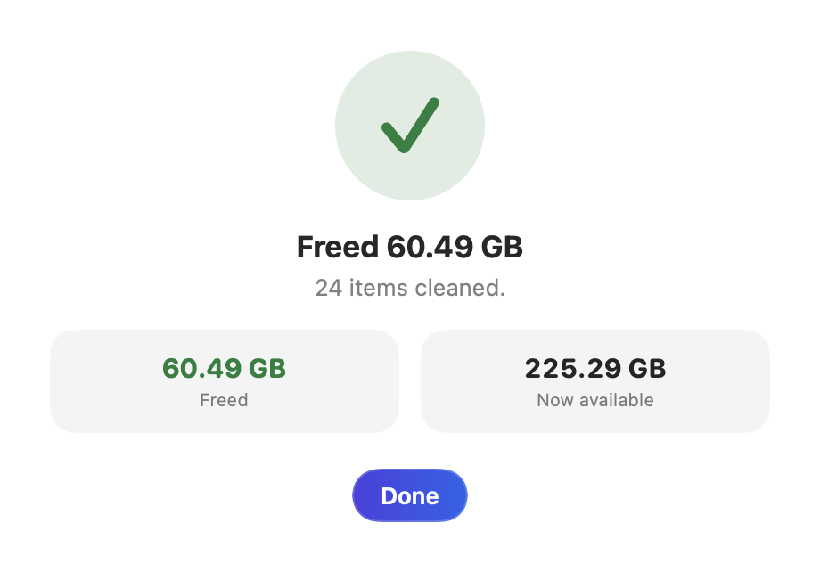
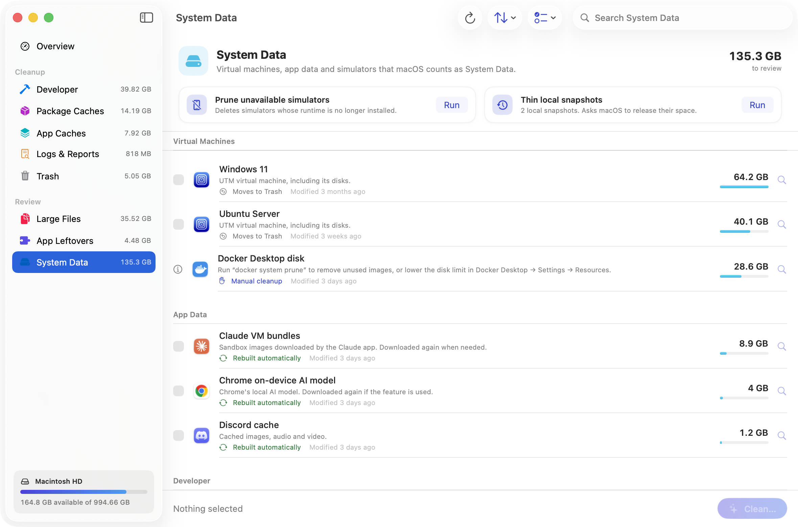
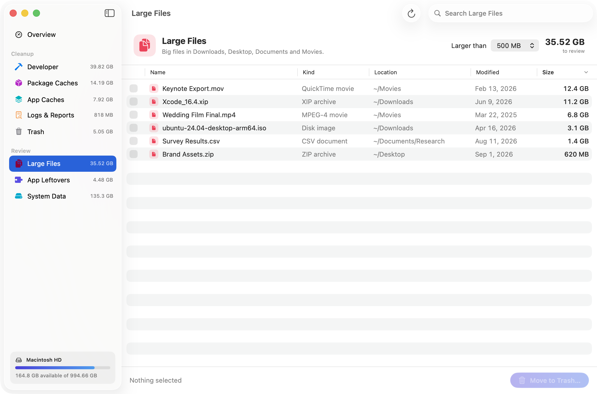
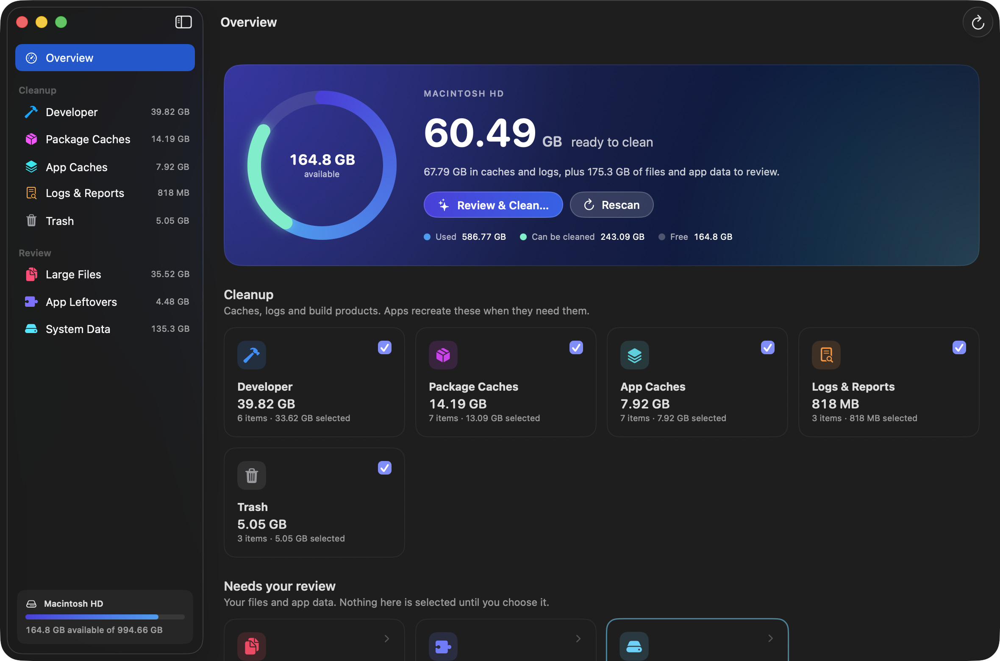
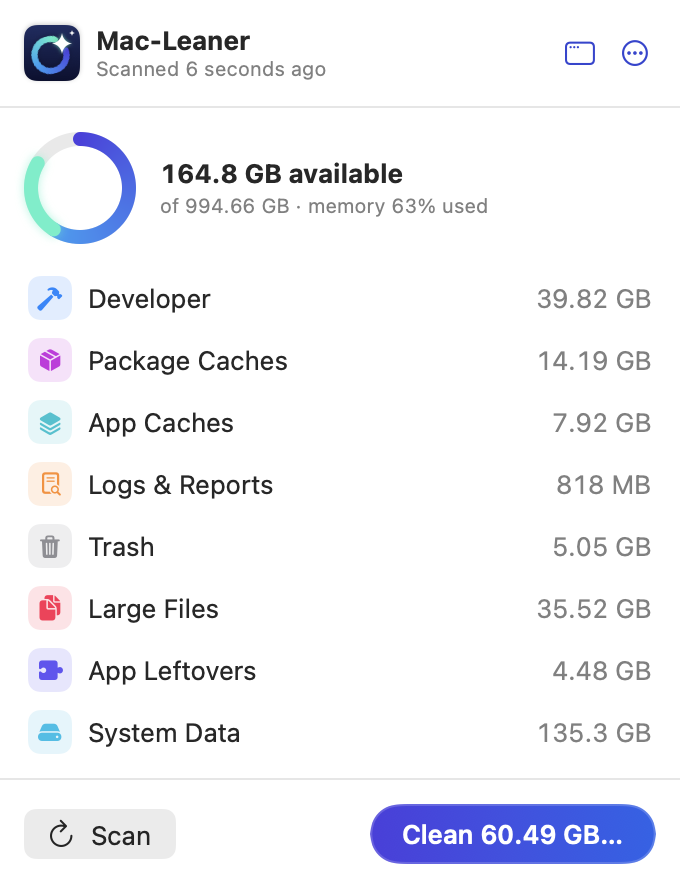

<p align="center">
  
</p>

<h1 align="center">Mac-Leaner</h1>

<p align="center">
  A careful, native storage cleaner for macOS.<br>
  Find what's filling your disk, review it, and get the space back without risking your files.
</p>

<p align="center">
  <a href="https://github.com/TheSecondVibe/Mac-Leaner/releases/latest"></a>
  <a href="https://github.com/TheSecondVibe/Mac-Leaner/actions/workflows/ci.yml"></a>
  
  
  <a href="LICENSE"></a>
</p>

<p align="center">
  
</p>

## Features

- **One scan, everything in view.** Developer files (Xcode DerivedData, device support, previews, simulator caches), package caches (Homebrew, npm, Yarn, pip, uv, Cargo, Gradle, Bun and more), app caches, logs and crash reports, and the Trash.
- **System Data, explained.** Virtual machines (UTM, Parallels, VMware), Docker's disk, app data such as Chrome's on-device AI model or Claude's VM bundles, simulator runtimes and macOS installers, with guidance for anything that has to be cleaned elsewhere.
- **Large files.** A sortable, Finder-style table of big files in Downloads, Desktop, Documents and Movies.
- **App leftovers.** Support folders from apps you removed, listed only when nothing has touched them for months.
- **Review before anything happens.** One sheet shows exactly what will be deleted permanently and what goes to the Trash, and warns you about apps that should be quit first.
- **Honest results.** Space freed, what moved to the Trash, and every item that couldn't be removed, with the reason.
- **Menu bar companion.** Free space at a glance, one-click scan, quick clean.
- **Native and fast.** SwiftUI, categories scanned in parallel, universal binary, no dependencies, no network access.

## How Mac-Leaner keeps your files safe

| Kind of data | What Mac-Leaner does |
| --- | --- |
| Caches, logs, build products | Removes them permanently. Apps rebuild them when needed. Safe items are preselected. |
| Your files, virtual machines, app data, leftovers | Moves them to the Trash, so you can put them back. Never preselected. |
| Things macOS or other apps manage (Docker's disk, simulator runtimes, staged updates) | Leaves them alone and explains how to reclaim the space. |

Every item passes a safety policy immediately before it is touched ([`SafetyPolicy.swift`](Sources/MacLeaner/Services/SafetyPolicy.swift)):

- Only locations inside your home folder are cleaned, plus macOS installer apps, which can only go to the Trash.
- Top-level folders such as Documents or `~/Library/Caches` are never removed themselves.
- Private data is never touched: Keychains, iCloud Drive, Mail, Messages, cloud storage folders, SSH keys.
- Permanent deletion is only allowed inside known cache, log and build-product locations.
- Symlinks are never followed out of those locations.
- Anything you exclude in Settings is off-limits.

Mac-Leaner contains no networking code. Nothing about your files leaves your Mac.

## Install

### Download

1. Download `Mac-Leaner-<version>.zip` from the [latest release](https://github.com/TheSecondVibe/Mac-Leaner/releases/latest) and unzip it.
2. Move **Mac-Leaner.app** to your Applications folder.
3. Mac-Leaner is a free open-source project and isn't notarized by Apple, so macOS blocks it the first time. Open it once, then go to **System Settings → Privacy & Security** and click **Open Anyway**. Alternatively, run:

   ```bash
   xattr -dr com.apple.quarantine /Applications/Mac-Leaner.app
   ```

### Build from source

Requires macOS 14 or later and Xcode 16 or later. Building it yourself also avoids the Gatekeeper prompt.

```bash
git clone https://github.com/TheSecondVibe/Mac-Leaner.git
cd Mac-Leaner
./scripts/build_app.sh
open build/Mac-Leaner.app
```

## Permissions

- **Desktop, Documents and Downloads.** macOS asks the first time Mac-Leaner looks for large files there.
- **Full Disk Access (optional).** Lets Mac-Leaner see the Trash, virtual machines inside app containers and some app data. Turn it on in **System Settings → Privacy & Security → Full Disk Access**. Mac-Leaner works without it and tells you what it can't see.

## Screenshots

| Review before cleaning | Results |
| --- | --- |
|  |  |
| **System Data** | **Large files** |
|  |  |
| **Dark mode** | **Menu bar** |
|  |  |

## Development

```bash
swift run MacLeaner             # run from source
swift run MacLeaner --demo      # sample data for UI work; never touches the disk
swift test                      # run the test suite
swift scripts/make_icon.swift   # regenerate the app icon
```

See [CONTRIBUTING.md](CONTRIBUTING.md) for the code layout and the rules every new cleanup location must follow.

## FAQ

**Is it safe to delete caches?**
Yes. Caches only hold copies of data an app can download or rebuild. The first launch or build afterwards may be a little slower while they're recreated.

**Why didn't my free space go up by exactly the amount cleaned?**
APFS can keep freed space in local Time Machine snapshots until macOS releases it. Use **Thin local snapshots** under System Data, or give macOS a little time.

**Why won't Mac-Leaner delete my Docker disk or simulator runtimes?**
Other apps manage those files, and deleting them directly can break the app. Mac-Leaner shows how much space they use and how to reclaim it safely.

**Does it need admin rights?**
No. Mac-Leaner only works inside your home folder, so it never asks for your password.

## License

Mac-Leaner is available under the [MIT License](LICENSE).
